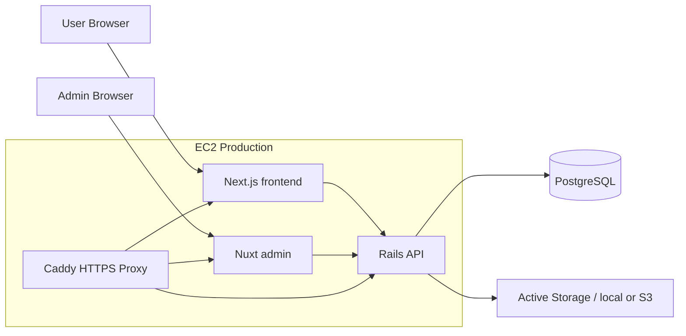

# Auction Platform

オークション形式の C2C マーケットプレイスを想定した、Rails API + Next.js + Nuxt Admin のフルスタック Web アプリケーションです。

商品の出品、検索、入札、即決購入、値段交渉、取引メッセージ、管理画面でのユーザー/商品/カテゴリ管理までを、1つの統合リポジトリで扱います。

## このリポジトリで見てほしいこと

- **フルスタック実装**: Rails API、Next.js ユーザー画面、Nuxt 管理画面を分離しつつ、Docker Compose でまとめて起動できます。
- **実運用を意識した設計**: ローカル開発用 Docker と EC2 本番用 Docker を分け、Caddy による HTTPS reverse proxy まで用意しています。
- **認証・認可**: `devise_token_auth`、HttpOnly Cookie、管理者 RBAC、所有者チェックを組み合わせています。
- **セキュリティ改善の履歴**: 商品更新/削除の認可、wallet API の不正増額防止、管理画面 token 永続保存の抑制など、脆弱になりやすい箇所を見直しています。
- **統合リポジトリ化**: 元々分かれていた `backend` / `frontend` / `admin` を monorepo として整理し、README、Docker、環境変数、デプロイ手順を統一しました。

## 画面と機能

### ユーザー向け

- 商品一覧、商品詳細
- 終了間近、1円スタート、最近の落札商品の表示
- 商品出品、画像アップロード
- オークション入札
- 即決購入
- 値段交渉
- お気に入り
- 取引メッセージ
- プロフィール、住所、ウォレット管理

### 管理画面

- 管理者ログイン
- ダッシュボード
- ユーザー管理
- 商品管理
- カテゴリ管理
- 管理者権限管理

### API

- `/auth` 共通認証
- `/auction/v1` ユーザー向け API
- `/admin/v1` 管理画面向け API
- `/web/v1` 将来のメインサイト向け API
- `/health` ヘルスチェック

## 技術スタック

| 領域 | 技術 |
| --- | --- |
| Backend | Ruby 3.2.4, Rails 7.1, PostgreSQL, devise_token_auth, Active Storage |
| Frontend | Next.js 15, React 19, TypeScript, Tailwind CSS, Zustand |
| Admin | Nuxt 4, Vue 3, Pinia, Vuetify |
| Infra | Docker, Docker Compose, Caddy, AWS EC2, S3 optional |
| Auth | Token auth, HttpOnly Cookie, RBAC |

## 全体構成

```text
.
├── backend/                 # Rails API
├── frontend/                # ユーザー向け Next.js
├── admin/                   # 管理画面 Nuxt
├── deploy/Caddyfile         # EC2本番用 reverse proxy
├── docker-compose.local.yml # ローカル開発用
├── docker-compose.yml       # EC2本番用
├── scripts/                 # 起動・デプロイスクリプト
└── docs / *.md              # 分析、環境、デプロイ手順
```



## ローカルで一発起動

Docker が入っていれば、初回からこのコマンドで起動できます。

```bash
./scripts/local-up.sh
```

起動後に開く URL:

```text
ユーザー画面  http://localhost:3001
管理画面      http://localhost:3003
API確認       http://localhost:3000/health
```

停止:

```bash
./scripts/local-down.sh
```

ローカル環境の詳細は [ENVIRONMENT_GUIDE.md](ENVIRONMENT_GUIDE.md) を参照してください。

## EC2 本番デプロイ

EC2 上では Caddy が `frontend` / `admin` / `api` の3ドメインを HTTPS で振り分けます。

```text
auction.example.com -> frontend
admin.example.com   -> admin
api.example.com     -> backend
```

初回は `.env.example` を `.env` にコピーし、本番値を設定します。

```bash
cp .env.example .env
```

最低限設定する値:

```env
FRONTEND_DOMAIN=auction.example.com
ADMIN_DOMAIN=admin.example.com
API_DOMAIN=api.example.com
CADDY_EMAIL=your-email@example.com

RAILS_MASTER_KEY=...
SECRET_KEY_BASE=...
DATABASE_PASSWORD=strong-password

APP_HOST=api.example.com
RAILS_HOSTS=api.example.com
FRONTEND_ORIGINS=https://auction.example.com,https://admin.example.com

NEXT_PUBLIC_API_BASE_URL=https://api.example.com
NEXT_PUBLIC_API_HOST=api.example.com
NUXT_PUBLIC_API_BASE=https://api.example.com
```

デプロイ:

```bash
./scripts/deploy-ec2.sh
```

詳しい手順は [DEPLOYMENT.md](DEPLOYMENT.md) を参照してください。

## 設計上の工夫

### 1. Rails API を中心にした名前空間設計

API を `/auction/v1`、`/admin/v1`、`/web/v1` に分けています。ユーザー向け機能と管理画面向け機能を同じ Rails API で扱いながら、責務が混ざらないようにしています。

### 2. 認証情報をブラウザ JS に寄せすぎない構成

ユーザー向け frontend では Next.js API Routes を Rails API の proxy として使い、Rails の token を HttpOnly Cookie に保存します。ブラウザ JavaScript から token を直接読みにくくするためです。

### 3. 管理者権限の分離

管理画面 API は `Admin::V1::BaseController` を通し、`admin` / `super_admin` とリソース単位の権限を確認します。

### 4. EC2 で動かしやすい Docker 構成

ローカル開発用と本番用の Compose を分けています。

- ローカル: hot reload、直接ポート公開
- 本番: build 済み image、Caddy reverse proxy、HTTPS、明示的 migration

### 5. セキュリティ観点の改善

開発途中で以下を見直しました。

- 商品更新/削除を出品者本人だけに制限
- wallet API を売上からポイントへのチャージのみに制限
- favorite の重複を DB unique index で防止
- 管理画面の固定 debug endpoint 送信を削除
- Rails container 起動時の自動 migration を廃止

## 主要ファイル

| ファイル | 役割 |
| --- | --- |
| [docker-compose.local.yml](docker-compose.local.yml) | ローカル開発用 Docker Compose |
| [docker-compose.yml](docker-compose.yml) | EC2 本番用 Docker Compose |
| [.env.example](.env.example) | 本番環境変数テンプレート |
| [.env.local.example](.env.local.example) | ローカル環境変数テンプレート |
| [ENVIRONMENT_GUIDE.md](ENVIRONMENT_GUIDE.md) | ローカル/本番の使い分け |
| [DEPLOYMENT.md](DEPLOYMENT.md) | EC2 デプロイ手順 |
| [PROJECT_ANALYSIS.md](PROJECT_ANALYSIS.md) | 構造分析と改善方針 |

## 開発コマンド

```bash
# ローカル起動
./scripts/local-up.sh

# ローカル停止
./scripts/local-down.sh

# EC2本番デプロイ
./scripts/deploy-ec2.sh

# 本番ログ確認例
docker compose --env-file .env -f docker-compose.yml logs -f backend

# Rails console
docker compose --env-file .env -f docker-compose.yml exec backend bundle exec rails console
```

## 今後の改善予定

- Nuxt admin も server route 経由の BFF 構成に寄せる
- OpenAPI schema から frontend/admin の TypeScript 型を生成する
- 購入、入札、オファー承認まわりの競合制御をさらに強化する
- Rails request spec と frontend/admin の E2E test を追加する
- EC2 単体から ECS / RDS / S3 / CloudFront 構成へ拡張する

## 就活・面接で説明できるポイント

- ただ画面を作るだけでなく、API、認証、管理画面、Docker、EC2 デプロイまで一通り設計しています。
- 既存の3リポジトリ相当の構成を統合し、monorepo として起動・デプロイしやすい形に整理しました。
- セキュリティ上危ない API を自分で洗い出し、認可・DB制約・token保管・本番設定を改善しました。
- ローカルと本番の責務を分け、初見の人でも `./scripts/local-up.sh` で動かせるようにしています。

